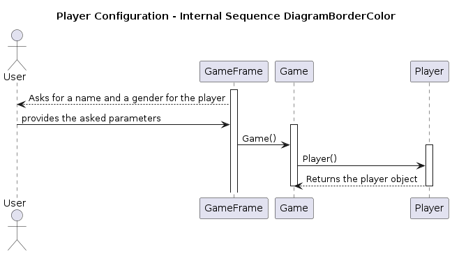

# Escape Room (Text Adventure) 

## Project for "Elementi di Ingegneria del Software"

- [lorenzo.nardin@studenti.unipd.it](mailto:lorenzo.nardin@studenti.unipd.it)
- [elia.sandrin@studenti.unipd.it](mailto:elia.sandrin@studenti.unipd.it)
- [marco.spolverato.1@studenti.unipd.it](mailto:marco.spolverato.1@studenti.unipd.it)
- [alessio.zanco@studenti.unipd.it](mailto:alessio.zanco@studenti.unipd.it)

## Game Manual

The game is a text adventure with a easy and clean graphic user interface (GUI). The player is in an escape room with an enemy, and he has to get out before being killed. You can insert the commands in a text field, and you can see the results of the action made in a text area, but also in the image shown in the GUI, which illustrate the wall you are looking at and the items you can interact with (e.g. keys, locks, bandages, etc.). The enemy makes a move every # moves the player makes. The moves include:
- changing the wall you are facing
- changing room (based on the doors placed in the room)
- picking up items (only the pickable ones)
- using items

### **Map & Rooms**
The game is played in a 9 rooms map of fixed design and each room has a variable number of objects (up to 8 items) and doors (from 0 to 4),always enabled, connecting to other rooms.
The main room from witch the game begins is also the final room where the game ends after having solved all the riddles and quiz consisting of varius challenges, from finding the right item to using logic and memory.

Each item has its own weight (expressed in Kg) and the player can carry a maximum ammount of weight (10 Kg).
Some items, like the hammer, can occupy almost all the carrable weight, forcing the player to carfully manage the storage.
Also, once used, the item dissapears, and by the time there's no way of throwing the items, in orther to free some space the player has to use them in the storage.

### **Player and commands**
At the beginning of the game, the user can choose the name and the gender of the player.
In orther to interract with the game, the player as to use the command line implemented in the GUI executing specific commands:

- north (command used to change the facing direction to north wall of the room)
- south (command used to change the facing direction to south wall of the room)
- east (command used to change the facing direction to east wall of the room)
- west (command used to change the facing direction to west wall of the room)

- croos DIRECTION (command used to change the room so that you cross the door to go to the relative north room. Only aveilable if door is present in the direction wall. Instead of DIRECTION the player will write the direction north, south, east or west)

- use ITEM (command used to interract with a specific item in your inventory. After using the item, it will dissapear freeing an ammount of carriable weight equivalent to the weight of the item just used. Only executable on item existing in the player storage)

- get ITEM (command used to interract with a specific item in the room. After keeping the item, it will appear in your inventory freeing an ammount of carriable weight equivalent to the weight of the item just used. Only executable on item existing in the player storage)

- inventory (command used to display a list of the item in the inventory)

- object_name (used to get info about an object in the inventory)

- help (command used to get a short description of commands)

- save (used to save the status of the game)

- quit (used to quit the game)

### Enemy

The enemy is a NPG randomly moving in the rooms of the maps, seeking for the player, with the scope to kill him by inflicting damage.

### Purpose of the game

As in the real-life escape-room the purpose of this game is to solve all the riddles, use all the objects and complete the puzzles to unlock the exit door and gain freedom. The player must also survive to the enemy looking who will randomly move each time the player makes a move.
When both the player and the enemy are in the same room, the enemy will start inflicting some damege to the player, who's provided with 5 hearts of healt points. Heach hit provides 1 damage point.
If the player's healt drops to zero point, the game ends with loss.
The player can also find and use some special healing items like bandages and painkillers to restore some healt points.

## Project

| Name | Version | Description |
| --- | --- | --- |
| Java | 17 | Version of Java defined in the `pom.xml` file for compiling and generating the target bytecode|
| JavaSwing | 1.0.3 | Platform used for develpment of client applications, based on Java, later on substitued with JavaFX |
| JUnit | 4.13.2 | Framework for Java class tests |

### Compile and Execute

Before executing the game or compiling the code form source, make sure you have **Java Developer Kit 17** (or above) correctly installed on your machine, otherwise it won't be able to compile or execute the game. 

The dependency are managed with **Maven**, but there is no need to have it installed on you machine: in fact you can use the Maven Wrapper configured in the repository just replacing the keyword `mvn` with `./mvnw` where specified in the following instructions.

First of all you need to clone the project using a terminal command, you can use the following command:

```bash
git clone https://github.com/nardib/TextAdventure
```

This command will clone the repository of the project from GitHub to your local machine. 

You can also download the zip file from https://github.com/nardib/TextAdventure/archive/refs/heads/main.zip : make sure to extract the content of the zip file in order to use it.

You can now enter the directory with:

```bash
cd TextAdventure
```

Now you can just play the game with the `text-adventure-x.x.x.jar` files in the `bin` directory clicking on the icon in your operating system or typing this command from the root directory:

```bash
java -jar bin/text.adventure-x.x.x.jar
```

**NOTE**: the execution of all the Maven commands requiers a pom.xml file, which is in the root directory, so make sure to execute the commands that starts with `mvn` there.

For compiling the program you can use Maven:

```bash
mvn compile
```

Now you can run the program with the command:

```bash
mvn exec:java
```

Maven will make sure to install all the dependency nedded to build correctly the project.

For creating the `.jar` executable file you can use:

```bash
mvn package
```

This command will both compile and test the code, other than creating the executable file.

You can find all the file generated by the previous commands in the `target` folder.

To execute the `.jar` file just created in the target directory use:

```bash
java -jar target/text-adventure-x.x.x.jar
```

#### Testing

For testing you can use the command:

```bash
mvn test
```

If you want a report of the test you can generate it with the command:

```bash
mvn site
```

This command also generates the javadoc documentation in `target/site/apidocs`

You can then find the report in `target/site/surefire-report.html`.

#### Additional Notes

If you want to delete all the file genderted by Maven in the `target` folder you can use:

```bash
mvn clean
```

With Maven you can also insert more aguments after the `mvn` keyword, e.g.:

```bash
mvn clean compile package
mvn compile test exec:java
```

### Save and Load usage

The game is configured to save and load game progress in an Amazon S3 bucket. To use this functionality make sure to use your personal AWS account to save your progresses.
First of all you need to set your AWS credentials to access the bucket in the `%UserProfile$\.aws\credentials` file on Windows or `~/.aws/credentials` on Linux and MacOS. The file must have this structure:

```
[default]
aws_access_key_id = YOUR_ACCESS_KEY_ID
aws_secret_access_key = YOUR_SECRET_ACCESS_KEY
```

where `YOUR_ACCESS_KEY_ID` and `YOUR_SECRET_ACCESS_KEY` are the credentials you need to generate from you AWS account.

The second thing you need to do is to modify `src/main/resources/config.properties` file:

```
bucketName=bucket-name
keyName=file-name.json
region=region
```
where `bucket-name` is the name of the S3 bucket you created, `file-name.json` is the name of the file to save in the bucket and `region` is the region of your bucket.

**Note**: saving the game status won't keep track of all the previous moves, so when restoring the game will just go back to the last move, and the back function will work from the restored state.

## Design Patterns

### GoF

#### Memento

The Memento design pattern is a behavioral design pattern that is commonly used to implement the "undo" functionality in applications. In the context of the Game class, the Memento pattern is utilized to save and restore the state of the game.

Within the Game class, there are two inner classes: GameMemento and GameCaretaker. The GameMemento class is responsible for capturing a snapshot of the game's state at a specific point in time. It stores the necessary information to restore the game to that particular state.

On the other hand, the GameCaretaker class is responsible for managing multiple GameMemento objects. It keeps track of all the snapshots taken throughout the game and provides a way to retrieve the most recent snapshot when needed.

The Game class itself acts as the originator in this pattern. It generates the GameMemento objects when necessary, allowing the game state to be saved. It also provides methods to restore the game state by utilizing the information stored in the GameMemento objects.

By implementing the Memento design pattern, the Game class enables the "undo" functionality, allowing players to revert the game state to a previous point in time. This can be useful in situations where players make mistakes or want to explore different paths within the game.

### GRASP

#### Information Expert

The Game class, following the Information Expert pattern, is responsible for managing the information and interactions between the Player, Enemy, and Map objects in the game. It acts as a central hub, coordinating the actions and behaviors of these entities.

As an expert in game management, the Game class keeps track of the current state of the game, including the player's location, the enemy's movements, and the layout of the map. It ensures that the player and enemy are in the correct rooms and handles the logic for moving between rooms.

Additionally, the Game class, with its expertise in inventory management, handles the player's inventory and the interaction with objects in the game. It allows the player to pick up items, use them, and manage their inventory weight. It also tracks the player's health and manages the enemy's attacks, inflicting damage when they are in the same room.

By leveraging its knowledge and expertise, the Game class creates a cohesive and immersive gaming experience. It ensures that the player can navigate the game world, solve puzzles, and ultimately achieve the goal of escaping the room.


#### High Cohesion

Each class in the project has been designed with a single, well-defined responsibility, following the principles of high cohesion. This means that each class focuses on a specific task or functionality, ensuring that it has a clear purpose and does not have unnecessary dependencies on other classes.

By adopting a black-box mindset, the project maintains a high level of independence and distinction between classes. This allows for easier maintenance and modification of individual classes without affecting the overall system. Each class can be developed, tested, and modified independently, promoting code reusability and flexibility.

The high cohesion pattern ensures that classes are self-contained and encapsulated, reducing the risk of unintended side effects and making the codebase more modular. This modular structure enables easier debugging, troubleshooting, and enhancement of specific functionalities without impacting the entire system.

Overall, the project's adherence to the high cohesion pattern promotes clean and maintainable code, making it easier to understand, extend, and collaborate on the project in the future.

#### Low Copuling

The project follows the low coupling pattern by minimizing the dependencies and interactions between the Game class, Player class, Enemy class, and Map class. The relationships between these classes are limited to method calls, ensuring loose coupling and promoting modularity.

By reducing the direct dependencies between classes, the project achieves greater flexibility and maintainability. Changes made to one class are less likely to have a cascading effect on other classes, allowing for easier modifications and updates. This also promotes code reusability, as individual classes can be used independently in other projects without bringing unnecessary dependencies.

The low coupling pattern enhances the project's overall stability and scalability. It allows for easier testing and debugging, as each class can be isolated and tested in isolation. Additionally, it facilitates future enhancements and extensions, as new classes can be added or existing classes can be modified without disrupting the entire system.

Overall, the low coupling pattern in the project promotes a modular and flexible design, enabling easier development, maintenance, and evolution of the software.

#### Creator

The Game class in this project utilizes the Creator design pattern to create instances of the Player, Enemy, and Map classes. By employing this pattern, the responsibility of object creation is delegated to the Game class, which acts as the creator.

The Creator design pattern promotes loose coupling and encapsulation by abstracting the process of object creation. It allows the Game class to create instances of the Player, Enemy, and Map classes without exposing the details of their construction to the client code.

By centralizing the creation logic within the Game class, it becomes easier to manage and modify the creation process. If there are any changes or variations in the way objects are created, the Game class can handle them without affecting the client code.

Additionally, the Creator design pattern enhances code reusability and flexibility. The Game class can create different types of players, enemies, and maps by implementing different creation methods or using different parameters. This allows for easy extension and customization of the game without modifying the existing codebase.

Overall, the use of the Creator design pattern in this project promotes modular and maintainable code, separating the object creation logic from the client code and providing a flexible and scalable architecture.

## Specifications


| Use case | Start |
| --- | --- |
| Brief description | User can start the game. |
| Actor | User |
| Basic flow | User presses `Start` button or `Load Game` button. |
| Alternative flow | If there are no saved game, it returns an error |
| Precondition | The game was succesfully installed. |
| Postcondition | Game configuration page is shown. |
| Extensions points | - |

| Use case | Player Configuration |
| --- | --- |
| Brief description | User can choose the name and gender of the player. |
| Actor | User |
| Basic flow | User writes the name and select the gender between the available options. |
| Alternative flow | No errors because pre-selected values are provided by default. |
| Precondition | User has started the game. |
| Postcondition | The game begins in its essence and the player finds itself in the first room, which is also the room where the game will end. |
| Extensions points | - |

| Use case | Commands |
| --- | --- |
| Brief description | User can play the game interacting through the command shell. |
| Actor | User |
| Basic flow | User interacts with the game, moving between the rooms, collecting objects in order to win the game solving the final puzzle. |
| Alternative flow | • The player is either killed by the enemy = LOSS or the player as solved the game = WIN • |
| Precondition | Game must be correctly started and with a valid configuration. |
| Postcondition | GUI updates after every move and the objects are modified following the given command. |
| Extensions points | The enemy also makes a move every time the player does one (or more) |

| Use case | Win |
| --- | --- |
| Brief description | User wins the game. |
| Actor | User |
| Basic flow | User unlocks the door in the room where all started. |
| Alternative flow | The player is killed. |
| Precondition | The player must have used all the items and must have visited all the rooms. |
| Postcondition | The enemy dissapears and a win screen is shown. |
| Extensions points | If the player was killed, then he has lost the game. |

| Use case | Back |
| --- | --- |
| Brief description | The user goes back of a move in the game. |
| Actor | User |
| Basic flow | User types `back` or `undo` as command and the game goes back of a move. |
| Alternative flow | The game returns an error message if there are no previous snapshots to restore. |
| Precondition | The user must have done at least one move. |
| Postcondition | The game is restored one move back. |
| Extensions points | - |

| Use case | Save and Exit |
| --- | --- |
| Brief description | User saves the state of the game and can resume the game later. |
| Actor | User |
| Basic flow | User types `save` and then the game can be closed via `exit` command. |
| Alternative flow | The game was already saved, so it can't be saved twice. The last progress of the game was not saved, so the game asks if the user wants to save the state of leave the game without saving. |
| Precondition | The user must have done at least one move. |
| Postcondition | The game is saved and the user can leave and resume the game later. |
| Extensions points | - |

## Design Documents

### Domain Model


### Design Class Model


### System Sequence Diagram


### Internal Sequence Diagrams

#### Player Configuration Sequence Diagram



#### Command Sequence Diagram


#### Undo Sequence Diagram


#### Save Sequence Diagram


## System Test Reports

All the system tests were executed on Windows 10, Windows 11 and Fedora 40

### Start

| Summary | The game starts with the player in the correct position |
| --- | --- |
| Test Case Design | - Test of game start without errors <br> - Test of correct initial configuration |
| Pre-Condition | The game was successfully installed |
| Post-Condition | Game configuration page is shown |
| Test Scripts | **Test of game start without errors:** <br> + Click on `New Game` button in the main screen <br> + Verify that is shown the game configuration screen without errors <br> **Test of correct intial configuration:** <br> + Click on `New Game` button on the main screen <br> + Configure the player <br> + Verify that the game is started in the defualt position |
| Test Case Execution Report | - Test of game start without errors: <br> - Test of correct initial configuration: |

### Player Configuration

| Summary | After pressing `New Game` in the main menu you configure the Player with a proper name and gender |
| --- | --- |
| Test Case Design | - Test a configuration and check if the name and pronoun are setted correctly and displayed during the game |
| Pre-Condition | User has started the game |
| Post-Condition | The game begins in its essence and the player finds itself in the first room, which is also the room where the game will end. |
| Test Scripts | **Test a configuration and check if the name and pronoun are setted correctly and displayed during the game:** <br> + Click on `New Game` button <br> + Compile the requested fields to configure the game <br> + Check during the game if the name and gender are displayed correctly |
| Test Case Execution Report | - Test a configuration and check if the name and pronoun are setted correctly and displayed during the game:  |


### Commands

| Summary | Given a specific command the game returns an output that matches with the inserted input |
| --- | --- |
| Test Case Design | - Test of all the commands for moving the player <br> - Test for all the commands to interact with the items in the map <br> - Test for invalid commands |
| Pre-Condition | Game must be correctly started and with a valid configuration. |
| Post-Condition | GUI updates after every move and the objects are modified following the given command. |
| Test Scripts | **Test of all the commands for moving the player:** <br> + Start a new game and select a valid configuration <br> + Move the player in the map changing the facing direction and the room making him cross the doors <br> + Verify that the player can cross only the walls with a door and the GUI is updated showing the current room and facing direction <br> **Test for all the commands to interact with the items in the map:** <br> + Start a new game and select a valid configuration <br> + Interact with all the items in a proper way according to the type of object <br> + Verify that all the items work as intended and there are errors that show the correct usage of the item when the commands are not used properly <br> **Test for invalid commands:** <br> + Start a new game and select a valid configuration <br> + Test a bunch of invalid commands <br> + Verify that after each invalid command an error message is displayed to show the correct usage of the command or it suggests to type `help` to get a list of valid commands |
| Test Case Execution Report | - Test of all the commands for moving the player: <br> - Test for all the commands to interact with the items in the map: <br> - Test for invalid commands: |


### Win

| Summary | After having solved the final puzzle the game shows the win screen |
| --- | --- |
| Test Case Design | - Test win |
| Pre-Condition | The player must have used all the items and must have visited all the rooms. |
| Post-Condition | The enemy dissapears and a win screen is shown. |
| Test Scripts | **Test win:** <br> + Start the game with a valid configuration <br> + Play all the game and collect all the items for the final puzzle <br> + Complete the final puzzle <br> + Verify that after having completed the final puzzle a win screen is shown and you can go back to the main menu |
| Test Case Execution Report | - Test win: |


### Back

| Summary | When inserted `back` (or `undo`) as command the game returns in the previous state |
| --- | --- |
| Test Case Design | - Test back function with no previous moves to undo <br> - Test back function with a previous move to undo <br> - Test back function several times with several previous moves to undo |
| Pre-Condition | The user must have done at least one move. |
| Post-Condition | The game is restored one move back. |
| Test Scripts | **Test back function with no previous moves to undo:** <br> + Start the game with a valid configuration <br> + Use `back` command <br> + Verify that a message that says that there are no previous moves to undo is shown and the state of the game doesn't change <br> **Test back function with a previous move to undo:** <br> + Start the game with a correct configuration <br> + Do at least one move to restore <br> + Use `back` command <br> + Verify that the previous move is restored and displayed correctly <br> **Test back function several times with several previous moves to undo:** <br> + Start the game with a valid configuration <br> + Do a ceratain number of moves <br> + Use `back` command several time <br> + Verify that after each `back` the game is restored to its previous state until the first move (inital configuration) |
| Test Case Execution Report | - Test back function with no previous moves to undo: <br> - Test back function with a previous move to undo: <br> - Test back function several times with several previous moves to undo: |


### Save and Exit

| Summary | When inserting `save` ad command the game saves its actual state and when pressing `exit` it returns to the main menu |
| --- | --- |
| Test Case Design | - Test save <br> - Test exit |
| Pre-Condition | The user must have done at least one move. |
| Post-Condition | The game is saved and the user can leave and resume the game later. |
| Test Scripts | **Test save:** <br> + Start a new game with a valid configuration <br> + Do some moves in the game <br> + Use `save` command and exit the game <br> + Try to log back in the game <br> + Verify that you are in the same state of when you saved the game <br> **Test exit:** <br> + Start a new game with a valid configuration <br> + Do some moves in the game <br> + Try to `exit` the game with the proper command <br> + Verify that the game goes back to the main screen after having asked if you want to save the game (if the current state was not already saved) |
| Test Case Execution Report | - Test save: <br> - Test exit: |
