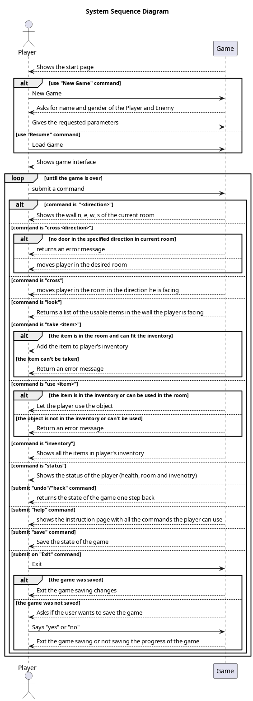
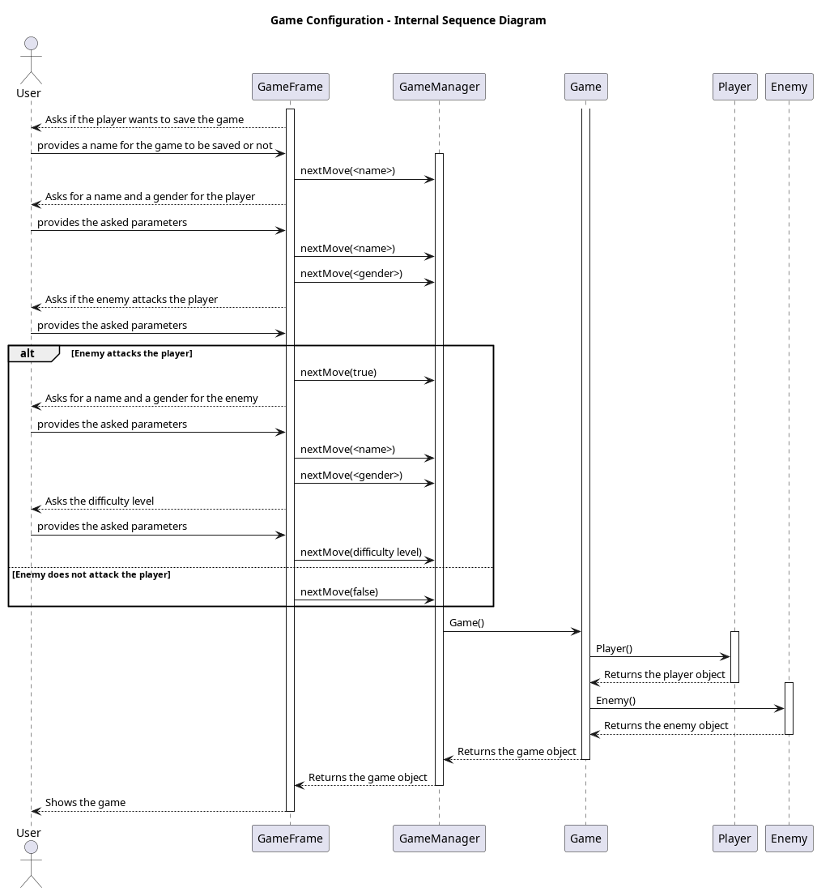
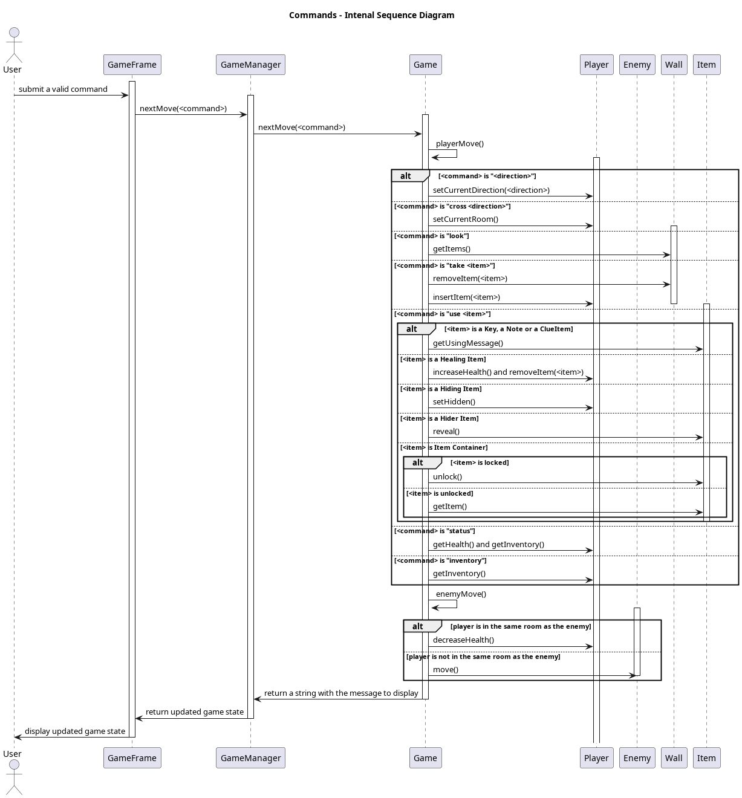

# Escape Room (Text Adventure)

## Project for "Elementi di Ingegneria del Software"

- [lorenzo.nardin@studenti.unipd.it](mailto:lorenzo.nardin@studenti.unipd.it)
- [elia.sandrin@studenti.unipd.it](mailto:elia.sandrin@studenti.unipd.it)
- [marco.spolverato.1@studenti.unipd.it](mailto:marco.spolverato.1@studenti.unipd.it)
- [alessio.zanco@studenti.unipd.it](mailto:alessio.zanco@studenti.unipd.it)

## Game Manual

The game is a text adventure with a easy and clean graphic user interface (GUI) provided with a screen, resizable, showing images to improve the user experience. Pressing F1 zooms the screen out, F2 zooms in and F11 selects full screen mode. The player is in an escape room with an enemy, and he has to get out before being killed. You can insert the commands in a text field, and you can see the results of the action made in a text area, but also in the image shown in the GUI, which illustrate the wall you are looking at and the items you can interact with (e.g. keys, locks, bandages, etc.). The enemy makes a move every # moves the player makes. The moves include:

- changing the wall you are facing
- changing room (based on the doors placed in the room)
- picking up items (only the pickable ones)
- using items

### **Map, Rooms & Items**

The game is played in a 9 rooms map of fixed design and each room has a variable number of objects (up to 8 items) and doors (from 1 to 4), always enabled, connecting to other rooms.
The main room from whitch the game begins is also the final room where the game ends after having solved all the riddles and quiz consisting of various challenges, from finding the right item to using logic and memory.

Each item has its own weight (expressed in Kg) and the player can carry a maximum amount of weight (10 Kg).
Almost all the items weight 1 Kg, but some others, like the bandages have a heavier weight.
Also, once used, the item disappears, and by the time there's no way of throwing the items, in order to free some space the player has to use them in the storage, forcing the player to carfully manage the inventory.

### **Player and commands**

At the beginning of the game, the user can choose whether to play a new game or to import a saved match. In case the player chooses to play a new match he will be asked to choose a name, to select the gender and to choose the difficulty level of the match (easy, medium or hard).
In addition, the user can decide if the enemy will be effectively able to inflict damage or to be a passive character.
In orter to interact with the game, the player as to use the command line implemented in the GUI executing specific commands:

- `north` or `n` : command used to change the facing direction to north wall of the room
- `south` or `s` : command used to change the facing direction to south wall of the room
- `east` or `e` : command used to change the facing direction to east wall of the room
- `west` or `w` : command used to change the facing direction to west wall of the room

- `croos DIRECTION` : command used to change the room so that you cross the door to go to the relative north room. Only available if door is present in the direction wall. Instead of DIRECTION the player will write the direction north, south, east or west

- `look` : command used to inspect the wall, looking for items

- `inventory` _ command used to display a list of the item in the inventory

- `take ITEM` : command used to interract with a specific item in the room. After keeping the item, it will appear in your inventory freeing an ammount of carriable weight equivalent to the weight of the item just used. Only executable on item existing in the player storage

- `use ITEM` : command used to interract with a specific item in your inventory. After using the item, it will disapear freeing an ammount of carriable weight equivalent to the weight of the item just used. Only executable on item existing in the player storage

- `help` : command used to get a short description of commands

- `undo`/`back` : command used for backing the status to the last move

- `save` : used to save the status of the game

- `quit`/`exit` : used to close the game window

### Enemy

The enemy is a NPC randomly moving in the rooms of the maps, seeking for the player, with the scope to kill him by inflicting damage.
According to the difficulty choosen at the start of the game the enemy will perform 1 move every 5 actions by the user in **EASY** mode, 1 move every 3 actions in **MEDIUM** mode and 1 move every user action in **DIFFICULT** mode.


### Purpose of the game

As in the real-life escape-room the purpose of this game is to solve all the riddles, use all the objects and complete the puzzles to unlock the exit door and gain freedom. The player must also survive to the enemy looking who will randomly move each time the player makes a move.
When both the player and the enemy are in the same room, the enemy will start inflicting some damage to the player, who's provided with 5 hearts of health points. Each hit provides 1 damage point. Health points are displayed on the top-left corner in the shape of 5 hearts while in the top center there are 10 stars showing the progress made.
If the player's health drops to zero point, the game ends with loss.
The player can also find and use some special healing items like bandages and painkillers to restore some health points.

## Project

| Name | Version | Description |
| --- | --- | --- |
| Java | 17 | Java version used to develop the project |
| JUnit | 4.13.2 | Framework for Java class tests |
| Jackson | 2.17.1 | Framework for converting objects into JSON stringifying them, and to convert back in the original shape through get and set methods using the ObjectMapper class |
| aws-sdk-for-java | 2.26.7 | Framework from the AWS SDK for accessing AWS Services Including S3 Bucket |
| Logback Classic Module | 1.5.6 | Used for monitoring the use of the AWS services and possibly intercept |

### Execution Environments and Constraints

The entire project was developed using Java, so it can be executed on any machine with a correctly installed JVM (either Windows, Linux or MacOS).

We have tested the project with JDK 17 (and above), so we suggest using this version, otherwise we don't guarantee that the game will work properly. To check the version of version of Java installed on your machine use this command in your OS terminal:

```bash
java --version
```

### Libraris Used

During the development of this game, we used the following libraries:

- **JUnit** as a testing framework, to ensure that all the main functionalities of the game work properly with specific tests for the main classes.

- **Jackson** to serialize the game state in a string format and to deserialize a string back into a game object. This was used to implement a save and load functionality, allowing the user to continue the game later by saving his current progress.

- **Amazon SDK for Java** to upload and download game states in an AWS S3 Bucket, enabling the user to save multiple states of more games online with his personal AWS credentials.

### Compile and Execute

Before executing the game or compiling the code form source, make sure you have **Java Developer Kit 17** (or above) correctly installed on your machine, otherwise it won't be able to compile or execute the game.

The dependencies are managed with **Maven**, but there is no need to have it installed on you machine: you can use the Maven Wrapper configured in the repository just replacing the keyword `mvn` with `./mvnw` where specified in the following instructions.

First, you need to clone the project using a terminal command:

```bash
git clone https://github.com/nardib/TextAdventure
```

This command will clone the repository of the project from GitHub to your local machine.

You can also download the zip file from [GitHub](https://github.com/nardib/TextAdventure/archive/refs/heads/main.zip): make sure to extract the content of the zip file in order to use it.

You can now enter the directory with:

```bash
cd TextAdventure
```

or

```bash
cd TextAdventure-main
```

if you have downloaded and unzipped the zip file.

Now you can play the game with the `text-adventure-x.x.x.jar` file in the `bin` directory clicking on the icon in your operating system or typing this command from the root directory:

```bash
java -jar bin/text.adventure-x.x.x.jar
```

Remember to change `x-x-x` with the current version of the game

**NOTE**: the execution of all the Maven commands requires a `pom.xml` file, which is in the root directory, so make sure to execute the commands that starts with `mvn` there.

For compiling the program you can use Maven:

```bash
mvn compile
```

Now you can run the program with the command:

```bash
mvn exec:java
```

Maven will make sure to install all the dependecies needed to build the project correctly.

For creating the `.jar` executable file you can use:

```bash
mvn package
```

This command will both compile and test the code, ad well as create the executable file.

You can find all the file generated by the previous commands in the `target` folder.

To execute the `.jar` file just created in the target directory use:

```bash
java -jar target/text-adventure-x.x.x.jar
```

#### Testing

For testing you can use the command:

```bash
mvn test
```

If you want a report of the test you can generate it with the command:

```bash
mvn site
```

This command also generates the javadoc documentation in `target/site/apidocs`

You can then find the report in `target/site/surefire-report.html`.

#### Additional Notes

If you want to delete all the file generted by Maven in the `target` folder you can use:

```bash
mvn clean
```

With Maven you can also insert more aguments after the `mvn` keyword, e.g.:

```bash
mvn clean compile package
mvn compile test exec:java
```

### Save and Load Usage

The game is configured to save and load game progress in an Amazon S3 bucket. To use this functionality make sure to use your personal AWS account to save your progresses.
First of all you need to set your AWS credentials to access the bucket in the `%UserProfile$\.aws\credentials` file on Windows or `~/.aws/credentials` on Linux and MacOS. The file must have this structure:

```
[default]
aws_access_key_id = YOUR_ACCESS_KEY_ID
aws_secret_access_key = YOUR_SECRET_ACCESS_KEY
```

where `YOUR_ACCESS_KEY_ID` and `YOUR_SECRET_ACCESS_KEY` are the credentials you need to generate from you AWS account.

The second thing you need to do is to modify `src/main/resources/config.properties` file:

```
bucketName=bucket-name
keyName=file-name.json
region=region
```

where `bucket-name` is the name of the S3 bucket you created, `file-name.json` is the name of the file to save in (or resume from) the bucket and `region` is the region of your bucket.

If you leave the `file-name.json` field void, the game will automatically ask during the game configuration if you want to save the game in the bucket with a specified name ([check this link for all the valid formats](https://docs.aws.amazon.com/AmazonS3/latest/userguide/object-keys.html)), with a defualt name (`game-status.json`) or if you don't want to save the game at all: note that if you specify the name, the game will automatically add the `.json` extension, so you don't have to. Also, when resuming a game it will print a list of games saved in the bucket and will ask it's name to make you select one (in this case you need to specify the extension).

**Note**: saving the game status won't keep track of all the previous moves, so when restoring the game will just go back to the last move, and the back function will work from the restored state.

## Design Patterns

### GoF

#### Memento

The Memento design pattern is used in the Game class to implement the "undo" functionality. It consists of two inner classes: GameMemento and GameCaretaker. GameMemento captures snapshots of the game's state, while GameCaretaker manages these snapshots. The Game class acts as the originator, generating and restoring game states using the stored information. This pattern allows players to revert to previous game states, enabling them to correct mistakes or explore different paths.

### GRASP

#### High Cohesion

The project follows the principles of high cohesion, with each class designed to have a single, well-defined responsibility. This promotes modular and independent development, allowing for easier maintenance and modification of individual classes without impacting the overall system. The codebase is self-contained and encapsulated, reducing the risk of unintended side effects and enabling easier debugging and enhancement of specific functionalities. Overall, the project's adherence to high cohesion results in clean and maintainable code that is easier to understand, extend, and collaborate on in the future.

#### Low Copuling

The project demonstrates the implementation of the low coupling pattern, which minimizes dependencies and interactions between classes. By reducing direct dependencies, the project achieves flexibility, maintainability, and code reusability. The pattern promotes modularity, allowing for easier modifications and updates without cascading effects. It enhances stability, scalability, and testing, enabling isolated testing and future enhancements. Overall, the low coupling pattern facilitates a modular and flexible design, promoting easier development, maintenance, and evolution of the software.

#### Creator

The Game class in this project utilizes the Creator design pattern to create instances of the Player, Enemy, and Map classes. This pattern promotes loose coupling and encapsulation by abstracting the object creation process. By centralizing the creation logic within the Game class, it becomes easier to manage and modify the creation process. The Creator design pattern enhances code reusability and flexibility, allowing for easy extension and customization of the game. Overall, it provides a modular and maintainable architecture.

## Specifications


| Use case | Start |
| --- | --- |
| Brief description | User can start the game. |
| Actor | User |
| Basic flow | User type `New Game` command or `Resume` command. |
| Alternative flow | If there is no saved game or the configuration of the s3 bucket is not done correctly, it returns an error |
| Precondition | The game was succesfully installed. |
| Postcondition | Game configuration page is shown. |
| Extensions points | - |

| Use case | Game Configuration |
| --- | --- |
| Brief description | User can choose the name and gender of the player and the enemy, and other setting like the difficulty level. |
| Actor | User |
| Basic flow | User writes the name and select the gender and the other settings from the available options. |
| Alternative flow | No errors because pre-selected values are provided by default. |
| Precondition | User has started the game with "new game" command. |
| Postcondition | The game begins in its essence and the player finds itself in the first room, which is also the room where the game will end. |
| Extensions points | - |

| Use case | Commands |
| --- | --- |
| Brief description | User can play the game interacting through the command shell. |
| Actor | User |
| Basic flow | User interacts with the game, moving between the rooms, collecting objects in order to win the game by solving the final puzzle. |
| Alternative flow | The player is either killed by the enemy = LOSS or the player has solved the game = WIN |
| Precondition | Game must be correctly started and with a valid configuration. |
| Postcondition | GUI updates after every move and the items are modified following the given command. |
| Extensions points | The enemy also makes a move every time the player does one (or more) |

| Use case | Win |
| --- | --- |
| Brief description | User wins the game. |
| Actor | User |
| Basic flow | User complete the puzzle in the central room. |
| Alternative flow | The player is killed. |
| Precondition | The player must have used all the items and must have visited all the rooms. |
| Postcondition | The enemy disapears and a win screen is shown. |
| Extensions points | If the player was killed, then they have lost the game. |

| Use case | Back |
| --- | --- |
| Brief description | The user goes back of a move in the game. |
| Actor | User |
| Basic flow | User types `back` or `undo` as command and the game goes back of a move. |
| Alternative flow | The game returns an error message if there are no previous snapshots to restore. |
| Precondition | The user must have done at least one move. |
| Postcondition | The game is restored one move back. |
| Extensions points | - |

| Use case | Save and Exit |
| --- | --- |
| Brief description | User saves the state of the game and can resume the game later. |
| Actor | User |
| Basic flow | User types `save` and then the game can be closed via `exit` command. |
| Alternative flow | The last progress of the game was not saved, so the game asks the user if he wants to save the state of leave the game without saving. |
| Precondition | The game must have been started correctly. |
| Postcondition | The game is saved and the user can leave and resume the game later. |
| Extensions points | - |

## Design Documents

### Domain Model


### Design Class Model


### System Sequence Diagram



### Internal Sequence Diagrams

#### Game Configuration Sequence Diagram



#### Command Sequence Diagram



#### Undo Sequence Diagram


#### Save Sequence Diagram


## System Test Reports

All the system tests were executed on Windows 10, Windows 11 and Fedora 40

### Start

| Summary | The game starts and let the player configure a new game or restore a previous one. |
| --- | --- |
| Test Case Design | - Test of game start without errors <br> - Test of correct restore of the previous game saved |
| Pre-Condition | The game was successfully installed |
| Post-Condition | Game configuration page is shown |
| Test Scripts | **Test of game start without errors:** <br> + Use "New Game" command on the main screen <br> + Verify that the game configuration screen is shown without errors <br> **Test of correct intial configuration:** <br> + Use "Resume" command on the main screen <br> + Verify that it shows a list of previous savings (if the `config.property` file and the credentials where set up correctly) <br> + Verify that the selected game starts in the same state it was in the last save |
| Test Case Execution Report | - Test of game start without errors: ✅ Passed <br> - Test of correct restore of the previous game saved: ✅ Passed |

### Game Configuration

| Summary | After using "New Game" command in the main menu the user configure the Player and Enemy with a proper name and gender and set the other setting. |
| --- | --- |
| Test Case Design | - Test a configuration and check if the name and pronoun are set correctly and displayed during the game; check also if the other settings are set corrected. |
| Pre-Condition |  User has started the game with "new game" command. |
| Post-Condition | The game begins in its essence and the player finds itself in the first room, which is also the room where the game will end. |
| Test Scripts | **Test a configuration and check if the name and pronoun are set correctly and displayed during the game:** <br> + Use "new game" command in the main menu <br> + Compile the required fields to configure the game <br> + Check during the game if the name and gender are displayed correctly |
| Test Case Execution Report | - Test a configuration and check if the name and pronoun are set correctly and displayed during the game: ✅ Passed  |

### Commands

| Summary | Given a specific command the game returns an output that matches with the inserted input |
| --- | --- |
| Test Case Design | - Test of all the commands for moving the player <br> - Test for all the commands to interact with the items on the map <br> - Test for invalid commands |
| Pre-Condition | Game must be correctly started and with a valid configuration. |
| Post-Condition | GUI updates after every move and the items are modified following the given command. |
| Test Scripts | **Test of all the commands for moving the player:** <br> + Start a new game and select a valid configuration <br> + Move the player on the map changing the facing direction and the room making them cross the doors <br> + Verify that the player can cross only the walls with a door and the GUI is updated showing the current room and facing direction <br> **Test for all the commands to interact with the items in the map:** <br> + Start a new game and select a valid configuration <br> + Interact with all the items in a proper way according to the type of object <br> + Verify that all the items work as intended and there are no errors, and show the correct usage of the item when the commands are not used properly <br> **Test for invalid commands:** <br> + Start a new game and select a valid configuration <br> + Test a bunch of invalid commands <br> + Verify that after each invalid command an error message is displayed to show the correct usage of the command or it suggests to type `help` to get a list of valid commands |
| Test Case Execution Report | - Test of all the commands for moving the player: ✅ Passed <br> - Test for all the commands to interact with the items in the map: ✅ Passed <br> - Test for invalid commands: ✅ Passed |

### Win

| Summary | After having solved the final puzzle the game shows the win screen |
| --- | --- |
| Test Case Design | - Test win <br> - Test lose |
| Pre-Condition | The player must have used all the items and must have visited all the rooms. |
| Post-Condition | The enemy dissapears and a win screen is shown. |
| Test Scripts | **Test win:** <br> + Start the game with a valid configuration <br> + Play through the game and collect all the items for the final puzzle <br> + Complete the final puzzle <br> + Verify that after having completed the final puzzle a win screen is shown and you can close the game <br> **Test lose:** <br> + Start the game with a valid configuration <br> + Move to the same room as the enemy <br> + Let the enemy attack you until your health points drop to zero <br> + Verify that the game end and the lose screen is shown and you can close the game |
| Test Case Execution Report | - Test win: ✅ Passed <br> - Test lose : ✅ Passed |


### Back

| Summary | When inserted `back` (or `undo`) as command the game returns to the previous state |
| --- | --- |
| Test Case Design | - Test back function with no previous moves to undo <br> - Test back function with a previous move to undo <br> - Test back function several times with several previous moves to undo |
| Pre-Condition | The user must have done at least one move. |
| Post-Condition | The game is restored one move back. |
| Test Scripts | **Test back function with no previous moves to undo:** <br> + Start the game with a valid configuration <br> + Use `back` command <br> + Verify that a message that says that there are no previous moves to undo is shown and the state of the game doesn't change <br> **Test back function with a previous move to undo:** <br> + Start the game with a correct configuration <br> + Make at least one move to restore <br> + Use `back` command <br> + Verify that the previous move is restored and displayed correctly <br> **Test back function several times with several previous moves to undo:** <br> + Start the game with a valid configuration <br> + Make a ceratain number of moves <br> + Use `back` command several times <br> + Verify that after each `back` the game is restored to its previous state until the first move (inital configuration) |
| Test Case Execution Report | - Test back function with no previous moves to undo: ✅ Passed <br> - Test back function with a previous move to undo: ✅ Passed <br> - Test back function several times with several previous moves to undo: ✅ Passed |


### Save and Exit/Quit

| Summary | When `save` command is inserted the game saves its actual state and when pressing `exit` it closes the game and asks to save the game first if the last state was not saved |
| --- | --- |
| Test Case Design | - Test save <br> - Test exit |
| Pre-Condition | The game must have been started correctly |
| Post-Condition | The game is saved and the user can leave and resume the game later. |
| Test Scripts | **Test save:** <br> + Start a new game with a valid configuration <br> + Do some moves in the game <br> + Use `save` command and exit the game <br> + Try to log back in the game using `resume` command <br> + Verify that you are in the same state of when you saved the game <br> **Test exit:** <br> + Start a new game with a valid configuration <br> + Do some moves in the game <br> + Try to `exit` the game with the proper command <br> + Verify that if the last state of the game was not saved the game asks to save it <br> + Verify that if the game closes properly (either saving or not saving the game based on the choice made in the previous step) |
| Test Case Execution Report | - Test save: ✅ Passed <br> - Test exit: ✅ Passed |

## Credits

Image generation was done thanks to [Leonardo.AI](https://leonardo.ai/) generative artificial intelligence tool. As a result, the images shown in the game may not be 100% accurate with the map and the description of the items that can be used.
