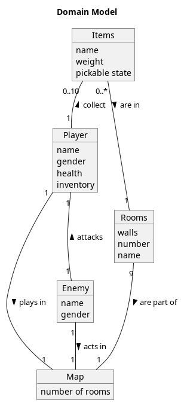
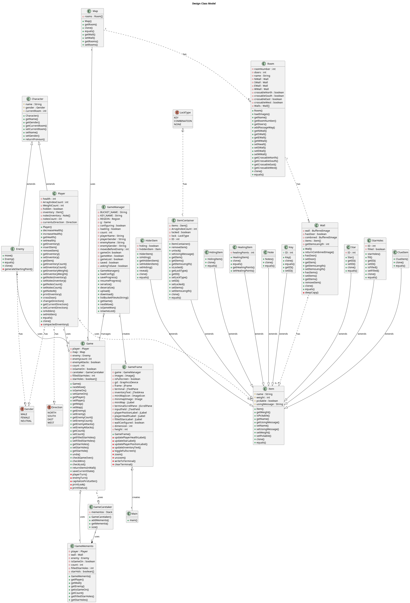
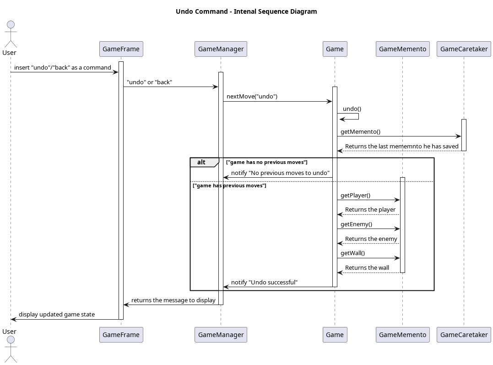
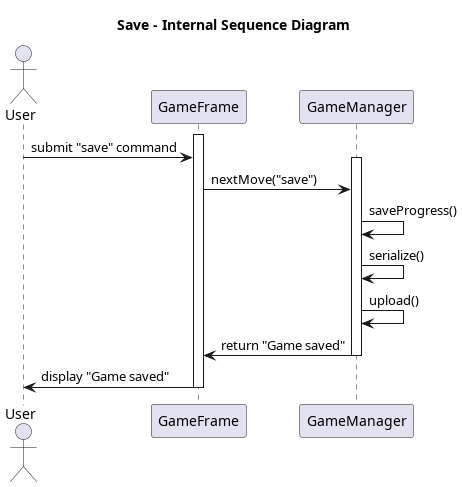

## Design Documents

### Domain Model

### Design Class Model

### System Sequence Diagram

### Internal Sequence Diagrams

#### Game Configuration Sequence Diagram

#### Command Sequence Diagram

#### Undo Sequence Diagram

#### Save Sequence Diagram

